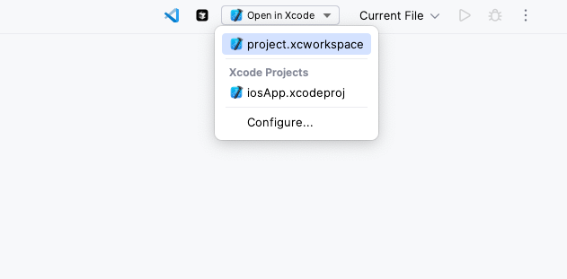
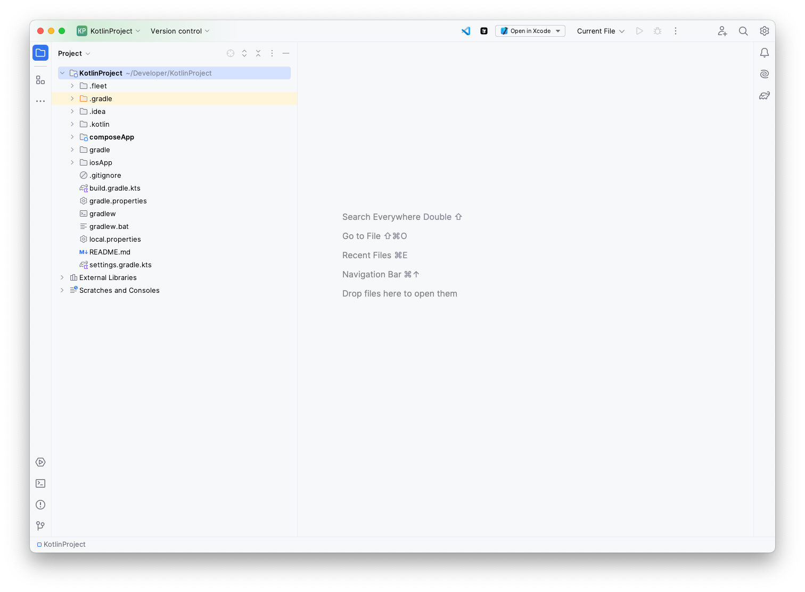

  

<h1 align="center">OpenInTools Support</h1>

  <b>Official support repository for the OpenInTools IntelliJ plugin</b>

  
  
  

  <a href="#-about">About</a> •
  <a href="#-plugin-information">Plugin Information</a> •
  <a href="#-features">Features</a> •
  <a href="#-usage">Usage</a> •
  <a href="#-configuration">Configuration</a> •
  <a href="#-reporting-issues">Reporting Issues</a> •
  <a href="#-feature-requests">Feature Requests</a> •
  <a href="#-faq">FAQ</a> •
  <a href="#-release-notes">Release Notes</a> •
  <a href="#-license">License</a>

## 📖 About

This repository serves as the official support channel for the OpenInTools plugin for IntelliJ IDEA. Here you can report issues, suggest features, and find help for using the plugin.

The main plugin repository is private, but all user support is handled through this public repository.

## 🔌 Plugin Information

OpenInTools enhances your IntelliJ IDEA workflow by providing seamless integration with popular external tools:

- **Visual Studio Code** - Open your project with a single click
- **Cursor Editor** - Quickly access your project in Cursor
- **Xcode** (macOS only) - Automatically detects and lists all Xcode workspaces and projects

  
   
  <em>OpenInTools integrates seamlessly into your IDE toolbar</em>

## ✨ Features

OpenInTools enhances your development workflow by providing seamless integration with popular external editors:

- **🚀 One-Click Access** - Integrated toolbar buttons for quick access to external tools
- **🔍 Visual Studio Code Integration** - Open your project in VS Code instantly
- **⚡ Cursor Editor Support** - Quickly launch your project in Cursor
- **🍏 Xcode Integration** - Automatically detects and lists all Xcode workspaces and projects (macOS only)
- **🔎 Smart Detection** - Automatically discovers installed tools on your system
- **🔧 Customizable** - Configure custom paths for all supported tools
- **💻 Cross-Platform** - Works on Windows, macOS, and Linux (Xcode feature is macOS only)

  
   
  <em>Easily select and open Xcode workspaces with the dropdown menu</em>

## 🚀 Usage

After installation, the plugin automatically adds three buttons to your IDE toolbar:

- **VS Code button** - Opens your project in Visual Studio Code
- **Cursor button** - Opens your project in Cursor Editor
- **Xcode button** - Shows a dropdown of available Xcode workspaces/projects (macOS only)

For Xcode, the plugin will scan your project for `.xcworkspace` or `.xcodeproj` files and present them in a dropdown menu, making it easy to select the specific workspace you want to open.

## ⚙️ Configuration

You can configure the plugin in:  
**Settings | Tools | Open In Tools**

Here you can:
- Set custom paths for VS Code, Cursor, and Xcode
- Use the auto-detect feature to find installed tools automatically

  
   
  <em>Configure tool paths in the settings panel</em>

## 🐛 Reporting Issues

If you encounter an issue with OpenInTools, please report it by [creating a new issue](https://github.com/abd3lraouf/OpenInToolsSupport/issues/new) with the following information:

1. **Description** - A clear description of the issue
2. **Steps to Reproduce** - Detailed steps to reproduce the problem
3. **Expected Behavior** - What you expected to happen
4. **Actual Behavior** - What actually happened
5. **Environment** - Your operating system, IntelliJ IDEA version, and OpenInTools version
6. **Screenshots** - If applicable, add screenshots to help explain your problem

## 💡 Feature Requests

Have an idea to improve OpenInTools? We'd love to hear it! To submit a feature request:

1. [Create a new issue](https://github.com/abd3lraouf/OpenInToolsSupport/issues/new)
2. Use the title format: `[Feature Request] Your Feature Idea`
3. Provide a detailed description of the feature and its potential benefits
4. If possible, include mock-ups or examples of how the feature might work

## ❓ FAQ

### Which IntelliJ-based IDEs are supported?

OpenInTools supports all IntelliJ-based IDEs, including IntelliJ IDEA, WebStorm, PyCharm, PhpStorm, and others.

### Is the Xcode integration available on Windows or Linux?

No, the Xcode integration is only available on macOS, as Xcode itself is a macOS-exclusive application.

### How does OpenInTools detect my installed tools?

The plugin automatically searches for common installation paths for VS Code, Cursor, and Xcode. If your installation is in a non-standard location, you can manually set the path in the plugin settings.

### Can I customize which files to open in each tool?

Currently, OpenInTools opens the entire project folder in VS Code and Cursor. For Xcode, you can select specific .xcworkspace or .xcodeproj files from the dropdown menu.

## 📝 Release Notes

See the [CHANGELOG.md](CHANGELOG.md) file for detailed release notes.

## 📄 License

OpenInTools is proprietary software. See the [LICENSE](LICENSE) file for details. This software is not open source and is protected by copyright laws.

---

Developed with ❤️ by <a href="https://github.com/abd3lraouf">Abdelraouf Sabri</a>
 