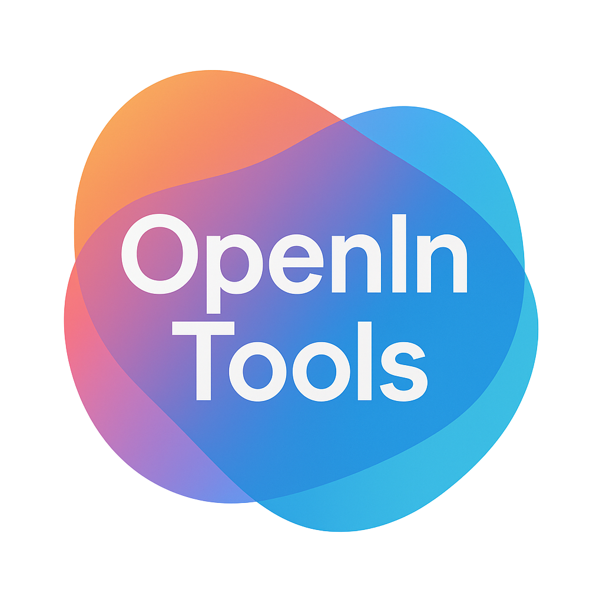

  

<h1 align="center">OpenInTools Support</h1>

  <b>Questions, bugs, ideas — you're in the right place.</b>

  
  
  
  

  <a href="#-what-is-openintools">What Is It</a> •
  <a href="#-getting-help">Get Help</a> •
  <a href="#-common-questions">FAQ</a> •
  <a href="#-whats-new">What's New</a>

---

## 🔌 What Is OpenInTools?

You know that moment when you're in Android Studio, but need to quickly check something in VS Code? Or you're working on a KMP project and need to hop into Xcode?

**OpenInTools is a JetBrains plugin that makes switching editors instant.** One click from your toolbar, and you're in the other editor — same file, same line. No hunting through folders.

  

### What You Can Do

- **Toolbar buttons** for your favorite editors — VS Code, Cursor, Xcode, and more
- **Right-click menus** on any file, folder, or tab
- **Quick switcher** (`Cmd+Shift+O`) with fuzzy search
- **Xcode dropdown** just like Android Studio's run configurations

  

### Supported Editors

| Editor | Platforms | Opens at Line |
|--------|-----------|:-------------:|
| VS Code | All | ✅ |
| Cursor | All | ✅ |
| Fleet | All | ✅ |
| Zed | macOS, Linux | ✅ |
| Sublime Text | All | ✅ |
| Windsurf | All | ✅ |
| Xcode | macOS | — |

---

## 🆘 Getting Help

### Found a Bug?

[Open an issue](https://github.com/abd3lraouf/OpenInToolsSupport/issues/new) and tell me:
- What happened
- What you expected to happen
- Steps to reproduce (if you can)
- Your OS, IDE, and plugin version

Screenshots help a lot!

### Have an Idea?

I'd love to hear it. [Start a discussion](https://github.com/abd3lraouf/OpenInToolsSupport/discussions) or [open an issue](https://github.com/abd3lraouf/OpenInToolsSupport/issues/new) with `[Feature]` in the title.

---

## ❓ Common Questions

<b>Which JetBrains IDEs work with this?</b>

All of them! IntelliJ IDEA, Android Studio, WebStorm, PyCharm, GoLand, Rider — if it's based on IntelliJ Platform 2025.2 or later, it'll work.

<b>I don't see Xcode in the toolbar. Is it broken?</b>

Xcode integration only shows up on macOS (since Xcode is macOS-only). If you're on a Mac and still don't see it, check if Xcode is installed at `/Applications/Xcode.app`.

<b>An editor isn't being detected. What do I do?</b>

Go to **Settings → Tools → Open In Tools** and set a custom path for that editor. The plugin searches common installation locations, but yours might be somewhere unusual.

<b>Can I open just a file, not the whole project?</b>

Yes! Right-click any file, folder, or editor tab. When you open a file, it jumps to the exact line you were on (in editors that support it).

<b>How do I reorder the toolbar buttons?</b>

**Settings → Tools → Open In Tools**. Drag and drop to reorder. You can set different orders for the toolbar and context menu.

<b>What's the Xcode "Selection Mode" vs "Direct Mode"?</b>

- **Selection Mode**: Click the Xcode button to see a dropdown of workspaces/projects. Click the play button to open your selection.
- **Direct Mode**: Click the button to open immediately (good when you only have one Xcode project).

Toggle in **Settings → Tools → Open In Tools → Xcode**.

---

## 🆕 What's New

### 2.1.2
- Improved documentation with human, storytelling tone

### 2.1.1
- Fixed DataContext error when opening Xcode dropdown (IntelliJ 2025.3+)
- Fixed plugin icon not showing in IDE plugin browser

### 2.1.0
- Xcode toolbar dropdown — works like Android Studio's run configuration selector
- Play button toggle for different workflows
- Smart opening: Info.plist files open in their workspace context
- Background project discovery with caching

See [CHANGELOG.md](CHANGELOG.md) for the full history.

---

## 📄 License

Proprietary Software — © 2025-2026 Abdelraouf Sabri. All Rights Reserved.

See [LICENSE](LICENSE) for details.

---

  Made with care by <a href="https://github.com/abd3lraouf">Abdelraouf Sabri</a>

